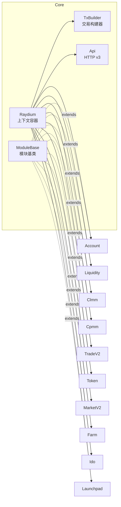
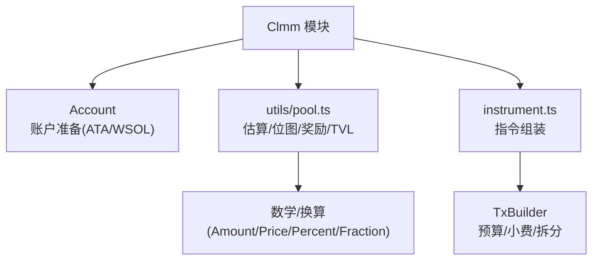
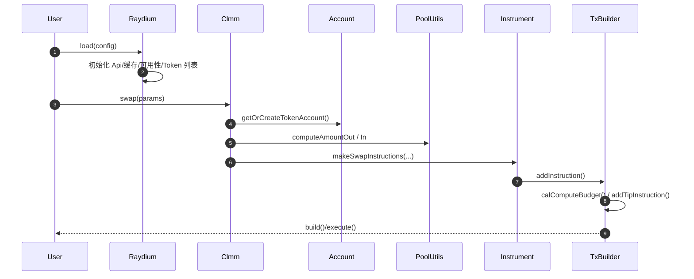
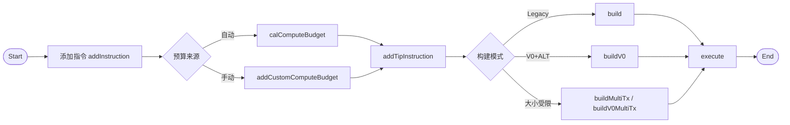

## Raydium SDK V2 项目总览

本文档从整体架构、目录结构、核心设计与模块协作方式出发，帮助快速理解并使用本 SDK。若需要更深入的交易构建与 CLMM 细节，请参考 `docs/raydium.md`。

### 项目定位

- **目标**: 为基于 Raydium 的应用（DApp/服务端脚本/研究工具）提供统一、易用且高性能的交互能力。
- **覆盖**: Token/账户、标准池与稳定池（Liquidity）、集中式流动性（CLMM）、恒定乘积做市（CPMM）、撮合交易（TradeV2）、市场（MarketV2）、农场（Farm）、IDO、Launchpad，以及统一的交易构建与发送能力（TxBuilder）。

### 架构关系图

### 目录结构与职责

- **`src/api/`**: Raydium HTTP API v3 封装（Token 列表、池/农场信息、可用性开关等），统一的类型与工具。
- **`src/common/`**: 通用能力与工具集（日志、错误、PDA/ProgramId、BN/Fraction/Percent 工具、Tx 构建工具 `txTool/` 等）。
  - `txTool/txTool.ts`: 交易构建器（收集指令、预算/小费注入、拆分/并行、多种 build 模式、V0+ALT 支持）。
- **`src/marshmallow/`**: Buffer layout 与二进制解析工具。
- **`src/module/`**: 独立的值对象与数学模块（`amount`/`price`/`percent`/`fraction`/`token` 等），与 UI 无关、可复用。
- **`src/solana/`**: Solana 相关类型、集群定义等。
- **`src/raydium/`**: 业务模块与入口容器。
  - `raydium.ts`: SDK 核心上下文容器（`Raydium`），聚合所有模块与全局缓存。
  - `moduleBase.ts`: 模块基类（`ModuleBase`），统一提供 `createTxBuilder()` 与日志/错误能力。
  - `account/`、`liquidity/`、`clmm/`、`cpmm/`、`tradeV2/`、`marketV2/`、`farm/`、`ido/`、`launchpad/`、`token/`：各业务域实现与指令装配。
- **`test/`**: 本地运行示例与集成测试入口（参考 `README.md` 的运行说明）。

### 核心设计与协作方式

- **Raydium 容器（`src/raydium/raydium.ts`）**

  - 统一注入与管理 `connection/cluster/owner/signAllTransactions`、HTTP `api` 客户端、日志与缓存（链上时间、epoch、Token 列表、可用性）。
  - 实例化并持有各业务模块（Account/Liquidity/Clmm/Cpmm/TradeV2/Token/Farm/Launchpad/MarketV2/Ido）。
  - 提供常用系统方法：`fetchChainTime()`、`fetchEpochInfo()`、`fetchV3TokenList()`、`fetchJupTokenList()`、`fetchAvailabilityStatus()`。

- **模块基类（`src/raydium/moduleBase.ts`）**

  - 所有业务模块继承 `ModuleBase`，共享统一的上下文 `scope: Raydium` 与 `logger`。
  - 提供 `createTxBuilder(feePayer?)`：自动注入连接、集群、费支付者、owner、API、签名器、区块哈希承诺等，便于快速构建交易。

- **交易构建器（`src/common/txTool/txTool.ts`）**

  - 指令收集：`addInstruction`（支持前置/后置指令、附带 signer/ALT）。
  - 预算注入：`calComputeBudget`（自动）/`addCustomComputeBudget`（手动）。
  - 小费注入：`addTipInstruction`。
  - 构建与执行：`build()/buildV0()`、按大小拆分 `buildMultiTx()/buildV0MultiTx()`，串并行执行与状态回调；支持 ALT 与循环查询确认。

#### 模块协作图（以 CLMM 为例）

- **API 协作（`src/api/`）**
  - 通过 `Api` 聚合 v3 接口，模块按需调用并缓存结果；`Raydium` 层集中做缓存策略与失效判断，避免重复请求。

### 业务模块概览（按常用度）

- **Account（`src/raydium/account/`）**: 钱包 Token 账户管理；ATA 计算/创建、WSOL 包装与可选关闭、订阅账户变更；常用方法 `fetchWalletTokenAccounts()`、`getOrCreateTokenAccount()`。
- **Token（`src/raydium/token/`）**: Token 列表加载与扩展解析（含 Token-2022 费用信息），提供基础换算工具与常量。
- **Liquidity（`src/raydium/liquidity/`）**: 标准池/稳定池的增删查；组装相关指令与金额换算。
- **CLMM（`src/raydium/clmm/`）**: 集中流动性高层 API（建池、头寸开/增/减/关、奖励、Swap）；
  - 工具层（`utils/pool.ts`）提供换算/估算、位图查询、奖励推进、TVL/APR 估算等；底层 `instrument.ts` 组装具体指令。
- **CPMM（`src/raydium/cpmm/`）**: 恒定乘积做市的增删查与交易能力。
- **TradeV2（`src/raydium/tradeV2/`）**: 路由与撮合的封装，结合池数据进行最优路径与报价。
- **MarketV2（`src/raydium/marketV2/`）**: 市场能力（如订单簿创建等）。
- **Farm（`src/raydium/farm/`）**、**IDO（`src/raydium/ido/`）**、**Launchpad（`src/raydium/launchpad/`）**: 对应业务场景的创建、操作与收益流程封装。
- **Utils1216（`src/raydium/utils1216/`）**: 常用辅助能力集合。

### 典型调用流程（示例：加载 + CLMM Swap）

1. `Raydium.load(config)` 创建上下文，内部初始化 `Api`、预拉取可用性、可选加载 Token 列表。
2. `raydium.clmm.swap(params)`：
   - `Account` 准备账户（ATA/WSOL）。
   - `utils/pool.ts` 估算 `computeAmountOut/computeAmountIn`。
   - `instrument` 组装指令并交给 `TxBuilder`。
   - `TxBuilder` 注入预算/小费，构建与执行交易（Legacy/V0）。

#### TxBuilder 工作流

### 数据与类型约定

- 数值统一使用 `BN`/`Decimal` 等精度安全类型；涉及 Token-2022 需考虑增量费用，统一通过 `getTransferAmountFeeV2` 处理。
- 使用 `PublicKey` 标识账户/代币 mint；跨模块通过 `ModuleBase` 的 `scope` 共享上下文。

### 开发与测试

- 安装：`yarn add @raydium-io/raydium-sdk-v2`（或参考 `package.json`）。
- 本地运行示例：参考 `README.md` 的 `yarn dev {directory}`（如 `yarn dev test/init.ts`）。
- TypeDoc：见 `typedoc.json`；类型导出入口 `src/index.ts`。

### 参考与关键文件

- 入门与架构：`docs/raydium.md`
- 入口与上下文：`src/raydium/raydium.ts`
- 模块基类：`src/raydium/moduleBase.ts`
- 交易构建：`src/common/txTool/txTool.ts`
- CLMM 高层与工具：`src/raydium/clmm/clmm.ts`、`src/raydium/clmm/utils/pool.ts`
