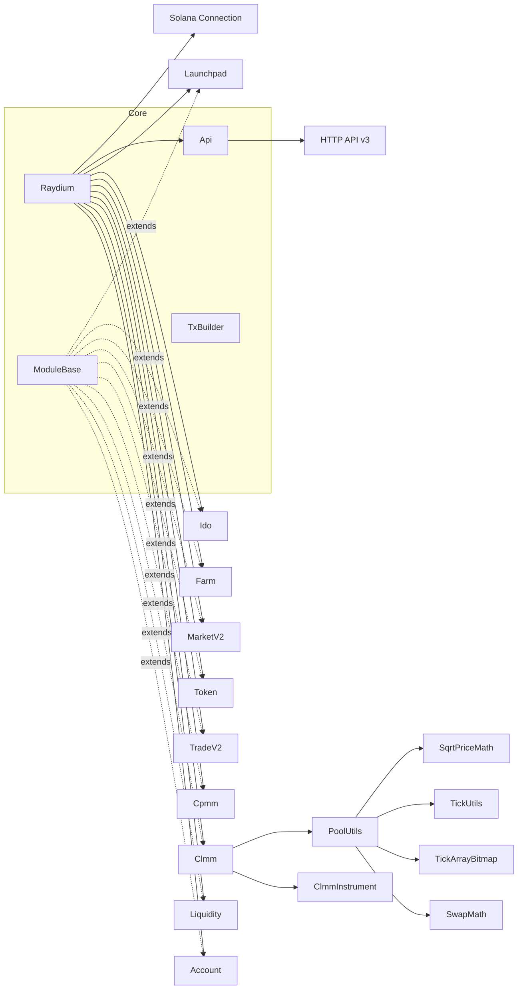
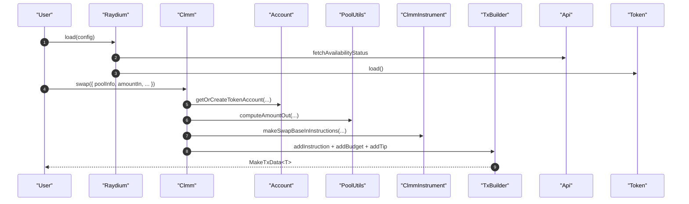

## Raydium SDK V2 架构与调用说明

本文档概述 Raydium SDK V2 的整体架构、关键模块职责、初始化方式、典型调用流程与最佳实践，帮助快速理解并高效集成。

### 概览

- **入口与上下文**: `Raydium` 是 SDK 的核心入口与上下文容器，统一管理 `connection/owner/api` 等资源，聚合所有业务模块。
- **模块基类**: 所有模块继承自 `ModuleBase`，使用 `createTxBuilder()` 生成 `TxBuilder` 来构建、签名并发送交易。
- **数据来源**: 组合 Solana RPC 与 Raydium V3 HTTP API；封装 Token/SPL-Token-2022 费用与账户逻辑。
- **交易构建**: `TxBuilder` 统一收集指令、注入 compute budget 与 tip、小/多笔交易构建与执行（Legacy/V0）。

### 架构总览

### 初始化与上下文

- 使用 `Raydium.load(config)` 一步创建并初始化：
  - 内部创建 `Api`，拉取功能可用性 `availability`，可选预加载 Token 列表（含 Jupiter）。
  - 统一注入 `connection/cluster/owner/signAllTransactions/blockhashCommitment/loopMultiTxStatus` 等上下文。
- 常用缓存：
  - 链上时间/偏移：`fetchChainTime()`（5 分钟有效）。
  - 纪元信息：`fetchEpochInfo()`（30 秒有效）。
  - Token 列表：`fetchV3TokenList()`、`fetchJupTokenList()`（带缓存，支持强制刷新）。

### 关键模块职责

- **Account（`src/raydium/account/account.ts`）**
  - 维护钱包 Token 账户缓存；计算/创建 ATA；WSOL 包装与可选关闭；支持账户变更订阅。
  - 常用方法：`fetchWalletTokenAccounts()`、`getAssociatedTokenAccount()`、`getOrCreateTokenAccount()`、`handleTokenAccount()`。
- **Token**
  - 加载 Token 列表，解析元信息与扩展（Token-2022 费配等），提供基础工具。
- **Clmm（`src/raydium/clmm/clmm.ts`）**
  - 高层 API：创建池、开/增/减/关仓位、锁仓/领取锁仓、奖励初始化/设置/领取、Swap。
  - 依赖：`ClmmInstrument`（底层指令组装），`PoolUtils`（撮合/路径/位图/奖励/TVL/APR/流动性计算）。
- **PoolUtils（`src/raydium/clmm/utils/pool.ts`）**
  - 交换估算：`computeAmountOut`（Base-In）、`computeAmountIn`（Base-Out）、`computeAmountOutFormat`。
  - TickArray/位图：`getFirstInitializedTickArray`、`nextInitializedTickArrayStartIndex`、`fetchExBitmaps`、`fetchMultiplePoolTickArrays`。
  - 奖励推进：`updatePoolRewardInfos`；TVL/APR 估算；流动性/金额换算。
- **Liquidity、Cpmm、TradeV2、MarketV2、Farm、Ido、Launchpad**
  - 分别覆盖标准池/稳定池、恒定乘积做市、路由撮合、市场（订单簿）、农场、IDO 与 Launchpad 场景能力。
- **ModuleBase（`src/raydium/moduleBase.ts`）**
  - 统一持有 `scope: Raydium` 与 `logger`，提供 `createTxBuilder()` 便捷地组装交易上下文。
- **TxBuilder（`src/common/txTool/txTool.ts`）**
  - 收集指令、注入 compute budget 与 tip；构建/签名/发送交易；支持按大小拆分为多笔；V0 支持 ALT。

### 典型调用流程：加载与 CLMM 交换

### 交易构建（TxBuilder）要点

- 指令收集：`addInstruction({ instructions, endInstructions, signers, lookupTableAddress, ... })`。
- 预算注入：
  - 自动：`calComputeBudget({ config?, defaultIns? })`（如未传入 config，会从 `solanacompass` 获取费况估算）。
  - 手动：`addCustomComputeBudget(config)`。
- 小费注入：`addTipInstruction(tipConfig)`。
- 构建与执行：
  - Legacy：`build()` → `{ execute(params) }`。
  - V0：`buildV0({ lookupTableCache, lookupTableAddress, forerunCreate, recentBlockhash })`。
  - 多笔/分片：`buildMultiTx()`、`sizeCheckBuild()`、`buildV0MultiTx()`、`sizeCheckBuildV0()`（支持串行/并行、状态回调）。

### 账户与费用处理

- 账户准备：`Account.getOrCreateTokenAccount()` 自动处理：
  - 计算/创建 ATA（`CreateATA` 指令）。
  - WSOL 包装（创建临时账户、转入、可选关闭）。
  - 可选链上校验 `checkCreateATAOwner`，确保 ATA 与 mint/owner 一致。
- Token-2022 费用：统一使用 `getTransferAmountFeeV2` 在估算/换算中处理增量费用。

### 数据缓存与可用性

- `raydium.fetchChainTime()`、`raydium.fetchEpochInfo()`：链上时间与纪元信息缓存，减少重复请求。
- `raydium.fetchV3TokenList()`、`raydium.fetchJupTokenList()`：Token 列表缓存与强制刷新。
- `raydium.fetchAvailabilityStatus()`：功能开关（如 swap、CLMM 增减仓等）按区域返回可用性。

### 最佳实践

- 设置上下文：在操作前设置好 `owner/connection`，并调用 `account.fetchWalletTokenAccounts()` 预热缓存。
- 检查可用性：使用 `raydium.availability` 动态控制功能显示与交互开关。
- 统一精度：使用 `BN/Decimal` 处理数值；涉及 Token-2022 均使用 `getTransferAmountFeeV2`。
- 善用缓存：合理利用时间/纪元/Token 列表缓存；必要时使用 `forceUpdate` 刷新。
- 错误处理：捕获 `ModuleBase.logAndCreateError` 抛出的错误，输出用户可读信息。

### 参考文件与关键入口

- `src/raydium/raydium.ts`: Raydium 入口与上下文容器，聚合模块与缓存。
- `src/raydium/moduleBase.ts`: 模块基类，`createTxBuilder()` 统一交易上下文。
- `src/common/txTool/txTool.ts`: `TxBuilder` 实现，交易构建/分片/签名/发送。
- `src/raydium/clmm/clmm.ts`: CLMM 高层 API。
- `src/raydium/clmm/utils/pool.ts`: 池数据/撮合/位图/奖励/估算工具。
